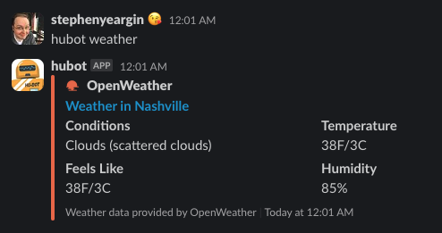

# OpenWeatherMap for Hubot

Retrieves the current conditions for a configured location or by query.

[](https://badge.fury.io/js/@stephenyeargin%2Fhubot-openweathermap) [](https://github.com/stephenyeargin/hubot-openweathermap/actions/workflows/nodejs.yml)

## Installation

In your hubot repository, run:

`npm install @stephenyeargin/hubot-openweathermap --save`

Then add **@stephenyeargin/hubot-openweathermap** to your `external-scripts.json`:

```json
[
  "@stephenyeargin/hubot-openweathermap"
]
```

### Configuration

| Environment Variables    | Required? | Description                              |
| ------------------------ | :-------: | ---------------------------------------- |
| `HUBOT_OPEN_WEATHER_MAP_API_KEY`  | Yes | API key from the developer console |
| `HUBOT_DEFAULT_LATITUDE` | No | Latitude for default query of `hubot weather` |
| `HUBOT_DEFAULT_LONGITUDE` | No | Longitude for default query of `hubot weather` |

## Usage

```
user1> hubot weather
hubot> Currently Clouds and 49F/10C in Nashville
```

### Slack


